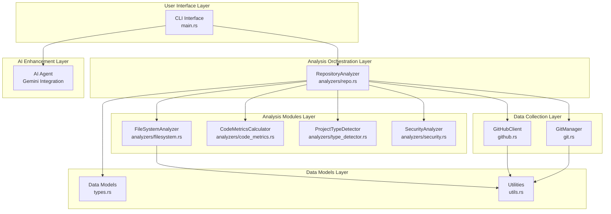
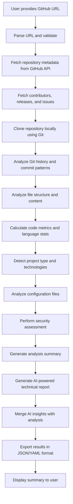
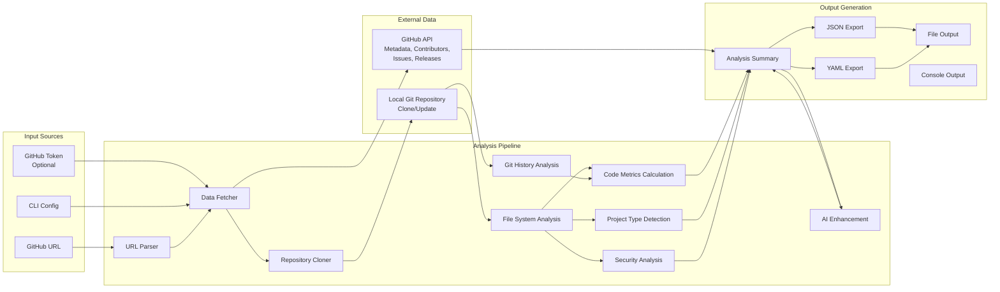

# AI Repository Analyzer (Rust)

A comprehensive command-line tool written in Rust that analyzes GitHub repositories to provide detailed insights about code quality, project structure, development activity, and more. This tool is designed for developers, project managers, and organizations who need to assess the health and characteristics of software projects.

## 🎯 What This Tool Does

The AI Repository Analyzer performs a multi-dimensional analysis of GitHub repositories by:

### 📊 **Code Analysis**

- **Code Metrics**: Calculates lines of code, file counts, language distribution, and complexity metrics
- **File Structure**: Analyzes directory organization, file types, and size distributions
- **Language Detection**: Identifies primary programming languages and their usage percentages

### 🔍 **Project Intelligence**

- **Technology Stack Detection**: Automatically identifies frameworks, build tools, package managers, and testing frameworks
- **Project Type Classification**: Determines if it's a web app, CLI tool, library, framework, etc.
- **Configuration Analysis**: Parses config files (package.json, Cargo.toml, requirements.txt, etc.)

### 📈 **Development Activity**

- **Git History Analysis**: Tracks commit patterns, contributor activity, and development velocity
- **Repository Health**: Monitors stars, forks, issues, and release patterns
- **Contributor Insights**: Identifies active contributors and collaboration patterns

### 🔒 **Security & Quality**

- **Security Assessment**: Checks for security policies, dependency vulnerabilities, and best practices
- **License Analysis**: Reviews licensing compatibility and requirements
- **Documentation Quality**: Evaluates README completeness and documentation structure

### 📋 **Comprehensive Reporting**

- **JSON/YAML Export**: Structured data output for integration with other tools
- **Summary Reports**: Human-readable analysis summaries
- **AI-Ready Data**: Structured data that can be fed into AI systems for further analysis

## 🏗️ Architecture Overview

The application follows a modular, layered architecture designed for maintainability and extensibility:

### Component Architecture



### Core Components

#### 1. **Main Entry Point (`main.rs`)**

```rust
// Command-line argument parsing
// Authentication setup (GitHub token)
// Analysis orchestration
// AI integration and output formatting
```

#### 2. **Repository Analyzer (`analyzers/repo.rs`)**

The central orchestrator that:

- Coordinates all analysis modules
- Manages the analysis workflow
- Aggregates results into comprehensive reports
- Handles error recovery and logging

#### 3. **Analysis Modules (`analyzers/`)**

- **`code_metrics.rs`**: Calculates code statistics, language distribution, complexity metrics
- **`filesystem.rs`**: Analyzes file structure, detects config files, parses documentation
- **`type_detector.rs`**: Identifies project types, frameworks, and technology stacks
- **`security.rs`**: Performs security analysis and vulnerability assessment

#### 4. **Integration Layers**

- **`git.rs`**: Local Git repository analysis using `git2` crate
- **`github.rs`**: GitHub API integration using `reqwest` for HTTP requests
- **`utils.rs`**: Helper functions for URL parsing, file processing, and data manipulation

#### 5. **AI Enhancement Layer**

- **Gemini Integration**: Uses Google's Gemini AI model to generate comprehensive technical reports
- **Intelligent Analysis**: Provides AI-powered insights and recommendations
- **Report Generation**: Creates professional technical documentation automatically

#### 6. **Data Models (`types.rs`)**

Comprehensive data structures for:

- GitHub API responses (users, repositories, issues, releases)
- Analysis results (code metrics, project info, security data)
- File system representations
- Git history data
- AI-generated insights

## 🔄 Analysis Workflow

The analysis process follows a comprehensive pipeline that combines traditional code analysis with AI-powered insights:



**Key Features of the Workflow:**

- **Parallel Processing**: GitHub API calls run concurrently for efficiency
- **AI Enhancement**: Automated generation of comprehensive technical reports
- **Flexible Output**: Support for both structured data and human-readable formats
- **Error Resilience**: Graceful handling of API failures and missing data

### Data Flow Architecture

This diagram shows how data flows through the system:

- **Input Sources**: GitHub URLs, authentication tokens, and configuration options
- **External Data**: GitHub API responses and local repository clones
- **Analysis Pipeline**: Sequential processing through various analysis modules
- **Output Generation**: Multiple output formats and destinations



### Component Architecture

The diagram above illustrates the layered architecture of the AI Repository Analyzer:

- **User Interface Layer**: Handles command-line interaction and user input
- **Analysis Orchestration Layer**: Central coordinator that manages the entire analysis workflow
- **Data Collection Layer**: Interfaces with external data sources (GitHub API and local Git repositories)
- **Analysis Modules Layer**: Specialized analyzers for different aspects of repository analysis
- **AI Enhancement Layer**: Integrates AI capabilities for intelligent report generation
- **Data Models Layer**: Core data structures and utility functions

## 🚀 Usage

### Basic Usage

```bash
# Analyze a public repository
./ai-repo-analyzer-rs https://github.com/owner/repo

# Analyze with GitHub token (recommended for higher rate limits)
./ai-repo-analyzer-rs https://github.com/owner/repo --token ghp_your_token_here

# Export analysis to file
./ai-repo-analyzer-rs https://github.com/owner/repo --output json --output-file analysis.json
```

### Command Line Options

- `--token <token>`: GitHub personal access token for higher API rate limits
- `--output <format>`: Output format (`json` or `yaml`, default: `json`)
- `--output-file <path>`: Save analysis results to specified file

### Environment Variables

- `GITHUB_TOKEN`: Set your GitHub token as an environment variable

## 📊 Sample Output

The analyzer generates comprehensive reports containing:

### Repository Overview

```
Repository: microsoft/vscode
Description: Visual Studio Code
Stars: 141,000, Forks: 24,000, Open Issues: 5,200
Primary Language: TypeScript
Total Files: 12,847, Lines of Code: 2,340,000, Size: 450 MB
Contributors: 1,247, Total Commits: 45,230
Frameworks: Electron, Node.js
Project Types: desktop-application, editor, ide
Languages: TypeScript (68.2%), JavaScript (15.4%), CSS (8.1%), HTML (4.3%)
```

### Detailed Analysis Sections

1. **Code Metrics**: File counts, LOC breakdown, language distribution
2. **Project Structure**: Directory analysis, file type distribution
3. **Technology Stack**: Detected frameworks, tools, and dependencies
4. **Development Activity**: Commit patterns, contributor statistics
5. **Security Assessment**: Vulnerability checks, license analysis
6. **Documentation Quality**: README completeness, documentation coverage

## 🛠️ Technology Stack

### Core Dependencies

- **`tokio`**: Asynchronous runtime for concurrent operations
- **`reqwest`**: HTTP client for GitHub API integration
- **`git2`**: Git repository manipulation and analysis
- **`serde`**: Serialization/deserialization for data export
- **`clap`**: Command-line argument parsing
- **`anyhow`**: Error handling and propagation
- **`log` + `env_logger`**: Structured logging

### Development Tools

- **`cargo`**: Rust package manager and build tool
- **Rust 2024 Edition**: Modern Rust language features
- **`walkdir`**: Recursive directory traversal
- **`regex`**: Pattern matching for file analysis
- **`chrono`**: Date/time handling for Git analysis

## 🎯 Use Cases

### For Developers

- **Code Review Preparation**: Understand codebase structure before contributing
- **Technology Assessment**: Evaluate unfamiliar frameworks or languages
- **Project Onboarding**: Quick overview of large codebases

### For Project Managers

- **Repository Health Monitoring**: Track development activity and project maturity
- **Technology Stack Analysis**: Understand dependencies and architecture decisions
- **Contributor Analysis**: Identify key contributors and collaboration patterns

### For Organizations

- **Due Diligence**: Assess open-source projects for adoption or contribution
- **Security Audits**: Automated security and license compliance checks
- **Portfolio Analysis**: Compare multiple repositories for consistency and quality

## 🔧 Configuration and Customization

### Analysis Depth

The tool analyzes the most recent 1,000 commits and top 50 contributors for performance. These limits can be adjusted in the source code for more comprehensive analysis.

### Supported Project Types

- **Web Applications**: React, Vue, Angular, Next.js, etc.
- **Backend Services**: Node.js, Python, Rust, Go, Java
- **Desktop Applications**: Electron-based apps
- **Libraries and Frameworks**: Detection of popular frameworks
- **CLI Tools**: Command-line utilities and scripts

### Extensibility

The modular architecture allows easy addition of:

- New analysis modules
- Additional data sources
- Custom output formats
- Specialized project type detectors

## 📈 Performance Considerations

- **API Rate Limits**: Uses GitHub API with authentication for higher limits
- **Local Analysis**: Clones repositories locally for detailed file analysis
- **Memory Usage**: Processes large codebases efficiently with streaming
- **Concurrent Operations**: Uses async/await for parallel API calls
